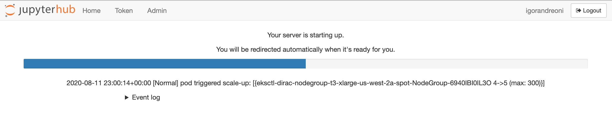
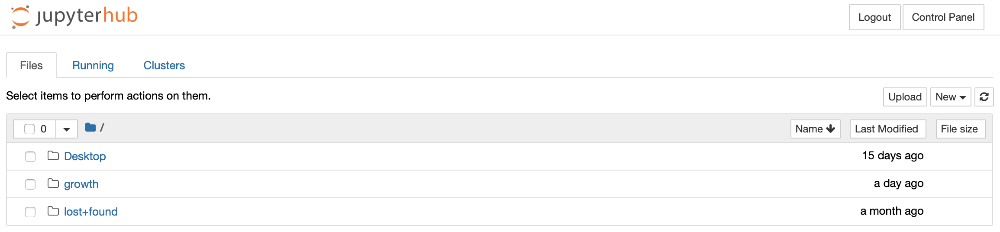
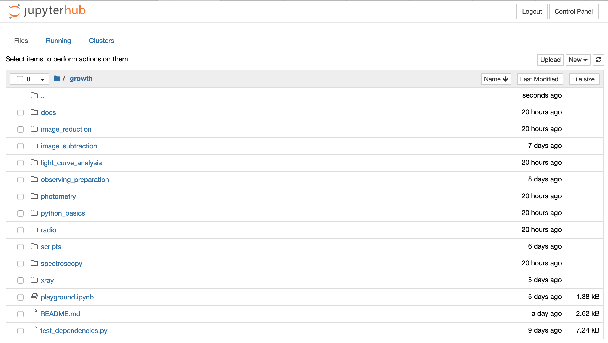

# GROWTH Astronomy School: Guide for JupyterHub users

Authors: Igor Andreoni (Caltech), David Kaplan (UWM), Steven Stetzler (UW), Mario Juric (UW)  
Contact: Igor Andreoni <andreoni@caltech.edu>

*********

A JupyterHub framework was setup for the GROWTH School 2020 (referred to as "the Hub" hereafter). The school participants can access, complete, and run the hands-on module entirely on the Hub. All the necessary software is already installed on the Hub, so there is no need for the school participants to download the modules and install the software locally.  

*********
### Login

In order to login the Hub, you must provide the school organizers with your GitHub account ID. [Most of the school attendees have already provided the organizers with their GitHub account, so you should be already set.] If you do not have a GitHub account yet, please register at https://github.com/join?source=login

Thanks to your GitHub account ID, the school organizers will add you to the `growth-astro-school` GitHub organization, in the appropriate team (Participants, Tutors, Admin). No action from you is required here. Becoming part of this organization will allow your account to be "whitelisted", so that you can login the Hub using your GitHub credentials.

In order to login to the Hub, start the server by clicking on this link: https://growth.dirac.institute/hub/login

Starting the server up can take up to 5-6 minutes. Please try to login at least a few minutes before the live session starts. When the server is loading, you should see a progress bar as in the image below:

*********
### Getting started

Upon login, you will find yourself in an entry page with three folders: `Desktop`, `growth`, and `lost+found`. 

All you need for the school lives in the `growth/` directory. Click on the `growth` link to enter the folder. You are now in the main directory, which should look like this:

 

The content of each module is located in the folder with the module's name. The notebooks used during the live sessions will be uploaded shortly before the school begins.

**ACTION REQUIRED:** Enter the `python_basics` folder and click on `python_basics.ipynb` to open the notebook. Please go through the python basics notebook content before the school begins!

You can keep practicing your Python skills directly in the `python_basics.ipynb` notebook and in the `playground.ipynb` notebook, which is located in the main `growth/` directory.

*********
### New to Jupyter?

If you would like to familiarize yourself with how Jupyter notebooks work, you can check out this [video](http://video.sdsu.edu/nas/capture/2018/rquimbysdsu.edu/jupyter/jupyter_-_20180830_102214_6.html) and [tutorial notebook](https://github.com/rmquimby/Astronomical_Techniques/blob/master/jupyter.ipynb).  If you want more general practice with github, python, etc there are more tutorials at [Robert Quimby's Astronomical Techniques class](https://github.com/rmquimby/Astronomical_Techniques)

You can freely test jupyter notebook commands using the `playground.ipynb` notebook, located in the `/growth/` directory.

*********
### Usage

When you login into the Hub, you can navigate the folders to find the Jupyter notebook of your choice. When you open the notebook, you can edit and run it freely. Your edits will remain saved even when the server is stopped and re-started.

* Opening and running a notebook:  
Navigate to the nootebook, click on its name and you should see the notebook opening in a new tab. Please familiarize yourself with the jupyter notebooks before the school begins, for example using the `playground.ipynb` test notwbook in the `/growth/` directory.

* Downloading the school material:  
The notebooks, the raw data, and the data products can be downloaded from the Hub to your computer at any time. On the Hub main interface, navigate to the file of interest, click on the checkbox on the left of the file name, then click the `Download` button that should have appeared on the top bar. There are other ways to download the content, too. For example, you can open the notebook you want to download, click `File`, click `Download As`, then choose a file format and download the file.  After the school finishes, you can download the school material directly from the GROWTH website: http://growth.caltech.edu/growth-school-2020.html

* Using ds9:  
During the school, you may want to visualize astronomical images using the ds9 application. To open a ds9 window, open a new **desktop** from the Hub main page (click on the `New` dropdown menu in the top-right corner of the page, then click on `Desktop`). A new desktop should open in a new tab. There, you should see a desktop icon for `ds9`. Alternatively, open a terminal and type `ds9 &` to start a new ds9 window. You can open an image from the `File` menu of the ds9 GUI, or you can open an image directly from command line by typing on the terminal, for example, `ds9 growth/module_name/data/image_name.fits`.  *ds9 will not work from  the terminal - you must use the desktop*

*********
### Testing the dependencies

Feel free to check that all the dependencies work correctly in your setup. Open a new terminal (`New` dropdown menu, `Terminal`), that should open in a new tab. Then run:

	python growth/test_dependencies.py

If everything works correctly, you should see the following output:

	Testing Python Dependencies
	1: Python Basics: Python Dependencies Installed Successfully
	2: Image Reduction: Python Dependencies Installed Successfully
	3: Photometry: Python Dependencies Installed Successfully
	4: Observing Run Preparation: Python Dependencies Installed Successfully
	5: Image Subtraction: Python Dependencies Installed Successfully
	6: Lightcurve Analysis: Python Dependencies Installed Successfully
	7: Spectroscopy: Python Dependencies Installed Successfully
	8: Xray Analysis: Python Dependencies Installed Successfully
	9: Radio Analysis: Python Dependencies Installed Successfully

	Testing External Dependencies
	sextractor is installed properly as sextractor. OK
	SWarp is installed properly as SWarp. OK
	psfex is installed properly as psfex. OK
	ds9 is installed properly as ds9. OK
	4 out of 4 external dependencies installed properly.

Please let the organizers know if any dependency gives you troubles.

### Notes
* If you need to restart your server (unusual but not impossible), go to the `Control Panel` in the upper right, click `Stop My Server`.  Wait a bit, then click `Start My Server` when it appears.  You likely will need to also click `Launch Server` after that.

* You cannot close the desktop except for killing the browser window/tab.  Do not use the XFCE `Log Out`.  If you do, you will need to restart your server (see above)

* `sextractor` is available via the name `source-extractor`.  Similarly, `swarp` is available via `SWarp`

* There are also some simple shell scripts to interact with `ds9` through the [XPA](http://ds9.si.edu/doc/ref/xpa.html) interface. For example, `ds9put <file> 1` will load the given file into buffer #1. You can load regions (`ds9reg`), delete regions (`ds9delreg`), match frames by WCS (`ds9wcs`), and other tasks.
